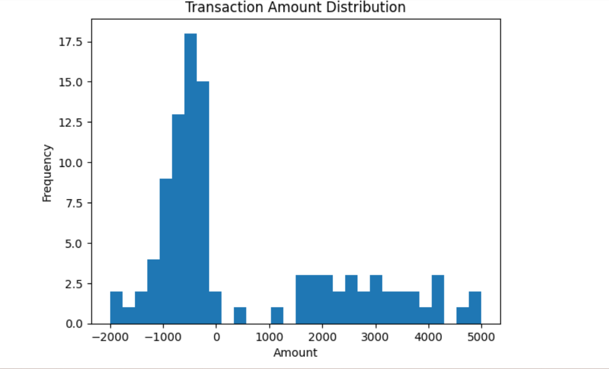

Core Banking Transaction Processing ETL (Local)
Overview

This project simulates a core banking end-of-day transaction processing pipeline using Python and SQLite. It demonstrates how banks ingest, validate, store, reconcile, and analyse transactional data in a controlled and auditable manner.

The solution is fully local and focuses on bank-grade data engineering principles rather than cloud tooling.

Architecture
CSV Files → Validation & Controls → SQLite Core Tables
                         ↓
                Rejected Transactions (Audit)
                         ↓
             Risk Features & Anomaly Detection
Key Features

• End-of-day batch transaction ingestion
• Debit/Credit integrity validation
• Duplicate and zero-amount detection
• Rejected transaction capture for audits
• Reconciliation and control totals
• Account-level risk feature engineering
• Anomaly detection using Isolation Forest
• Operational and risk visualizations

Technology Stack

• Python
• Pandas
• SQLite
• SQL
• Jupyter Notebook
• scikit-learn
• matplotlib

Database Tables

• transactions – validated core banking transactions
• rejected_transactions – audit and compliance records
• account_risk_features – ML-ready risk indicators

How to Run the Project

Clone the repository

Install dependencies

pip install -r requirements.txt

Open the Jupyter notebook

jupyter notebook notebooks/transaction_etl_core_banking.ipynb

Run all cells sequentially

Banking Concepts Demonstrated

• End-of-day batch processing
• Auditability and traceability
• Data quality controls
• Risk pre-screening
• Explainable analytics

Future Enhancements

• Incremental day-over-day loads
• Customer master data with SCD Type 2
• Rule-based fraud flags
• Power BI operational dashboards

Author

Khangwelo Nicholus Maphaha
Data Engineer | SQL | Python | Banking & Analytics
